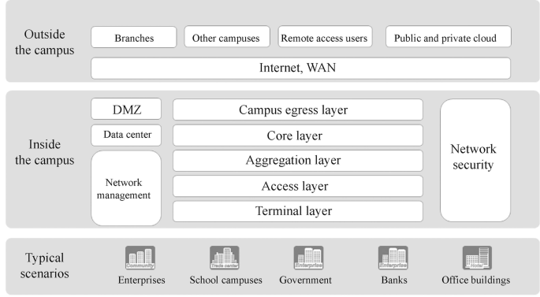

# Week 16
## Table of Contents

- [Week 16](#week-16)
  - [Table of Contents](#table-of-contents)
  - [Cara Kerja DNS dan Mail Server](#cara-kerja-dns-dan-mail-server)
    - [DNS](#dns)
    - [Mail Server](#mail-server)
    - [Arsitektur Jaringan Umum di Kampus](#arsitektur-jaringan-umum-di-kampus)
      - [Campus Network](#campus-network)

## Cara Kerja DNS dan Mail Server
### DNS
Cara kerja DNS server adalah salah satu hal yang penting untuk dipahami dalam dunia teknologi informasi. DNS server memiliki peran utama dalam mengonversikan nama domain ke alamat IP sehingga mempermudah pengguna untuk mengakses suatu situs web. Dalam hal ini, DNS server berfungsi sebagai mesin pencari atau mesin penerjemah nama domain menjadi alamat IP.

Proses cara kerja DNS server dimulai saat pengguna memasukkan nama domain pada browser. Nama domain tersebut akan diteruskan ke DNS server yang terdapat pada jaringan lokal atau provider internet. Jika DNS server tidak menemukan informasi yang dicari, maka DNS server akan mengirimkan permintaan ke DNS server lainnya hingga menemukan informasi yang dibutuhkan.

Setelah informasi ditemukan, DNS server akan mengirimkan informasi alamat IP dari nama domain tersebut ke browser. Browser kemudian akan mengakses alamat IP tersebut dan menampilkan konten dari situs web yang dituju. Proses ini berlangsung secara cepat dan efisien sehingga pengguna dapat mengakses situs web dengan mudah dan cepat.

### Mail Server
Pada dasarnya, proses pengiriman email dari pengirim ke penerima hanya terdiri dari dua jalur, yaitu kotak keluar pengirim dan kotak masuk penerima. Akan tetapi, cara kerja mail server tidak sesederhana itu. Ada proses panjang hingga akhirnya pesan bisa masuk ke penerima.

Ketika seseorang mengirim sebuah email, pesan tersebut akan dikirim ke sistem melalui protokol SMTP. Kemudian, sistem tersebut akan mengonfirmasi dan memverifikasi apakah pengirim memenuhi syarat untuk mengirimkan pesan tersebut. Persyaratannya bisa berupa kelengkapan isi pesan, subjek, hingga alamat email penerima. 

Setelah itu, protokol tersebut akan mengolah kembali data yang masuk dan memeriksa apakah pesan tersebut tidak mengandung virus berbahaya. Selain itu, jika pesan yang Anda tuliskan tidak lengkap, sistem bisa menganggapnya sebagai spam dan tidak muncul secara langsung ke penerima. 

Sistem akan menyimpan pesan tersebut ke dalam kotak surat sesuai dengan alamat email yang dituju. Kotak surat tersebut biasanya dapat diakses oleh pemilik alamat email melalui webmail yang digunakan. 

Terakhir, penerima pesan dapat menerima dan membuka pesan yang ada di kotak masuk melalui protokol IMAP (Internet Message Access Protocol) atau POP (Post Office Protocol). Protokol POP akan menyalin pesan dari sistem dan menyimpannya ke dalam kotak masuk penerima. Sementara itu, protokol IMAP memungkinkan user untuk mengakses pesan langsung dari mail server. 

### Arsitektur Jaringan Umum di Kampus
#### Campus Network

Jaringan kampus adalah jaringan area lokal yang menghubungkan orang dan benda dalam area terbatas, dan biasanya hanya memiliki satu badan pengelola. Jika terdapat beberapa badan pengelola maka dianggap sebagai beberapa jaringan kampus.

Jaringan kampus bisa berukuran besar atau kecil, mulai dari jaringan yang lebih kecil seperti kantor rumah kecil (SOHO) dan jangkauan nirkabel di kedai kopi, hingga jaringan yang lebih besar seperti jaringan untuk kampus, kampus perusahaan, taman, dan pusat perbelanjaan. Skala kampus terbatas, dan ukuran umum kampus besar, seperti kampus perguruan tinggi dan kawasan industri, umumnya hanya beberapa kilometer persegi. Dalam rentang ini, kita dapat menggunakan teknologi LAN untuk membangun jaringan. Sebuah “kampus” yang lebih besar dari ini biasanya dianggap sebagai “wilayah metropolitan” dan perlu menggunakan teknologi WAN, dan jaringan terkait akan dianggap sebagai MAN.

Jaringan kampus dapat digunakan di perusahaan, universitas/sekolah, pemerintahan, bank, dan gedung perkantoran. Di dalam jaringan kampus biasanya terdapat desain hierarki dan regional. Desain hierarki berdasarkan lokasi perangkat dalam jaringan dapat membagi perangkat jaringan menjadi terminal layer (perangkat nirkabel seperti komputer dan telepon seluler berada di terminal layer), access layer, aggregation layer, dan core layer. Menurut fungsi yang dicapai, jaringan dibagi menjadi network management, network security, Demilitarized Zone (DMZ), dan data center zone. Area yang menghubungkan bagian luar kampus adalah campus egress layer, yang menghubungkan cabang lain, kampus lain, pengguna akses jarak jauh dan private dan public cloud melalui Internet dan WAN (Wide Area Network).

Teknologi LAN yang umum digunakan dalam jaringan kampus meliputi teknologi Ethernet (kabel) yang mengikuti standar IEEE 802.3 dan teknologi Wi-Fi (nirkabel) yang mengikuti standar IEEE 802.11.

